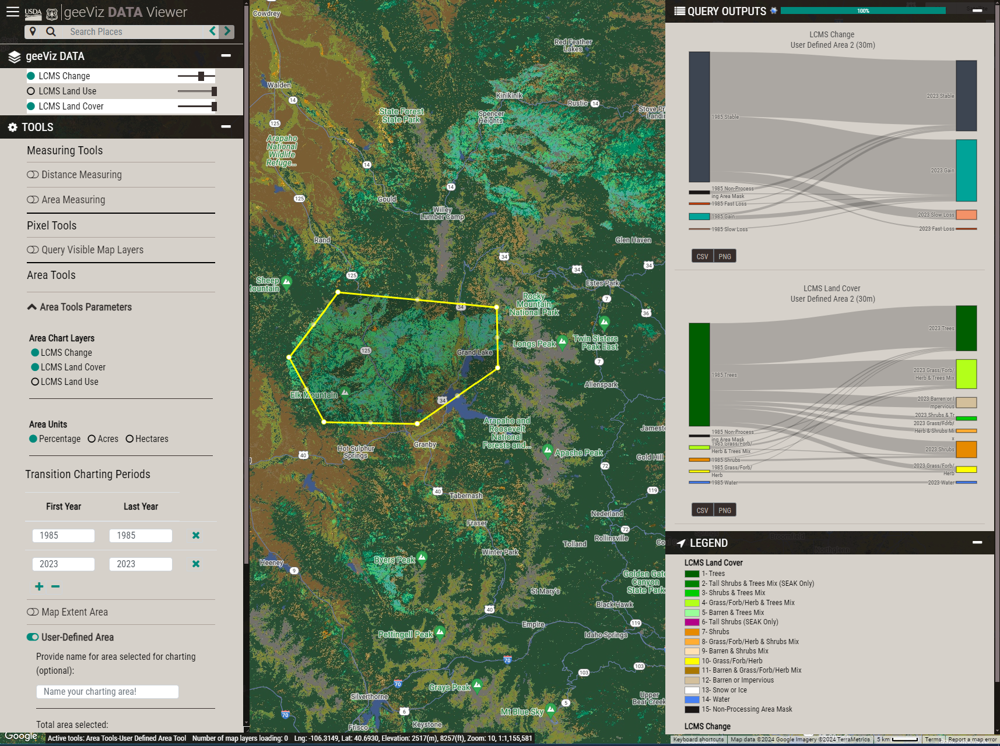

.. geeViz documentation master file, created by
   sphinx-quickstart on Thu Mar  7 11:03:07 2024.
   You can adapt this file completely to your liking, but it should at least
   contain the root `toctree` directive.

geeViz Documentation
==================================

 
* geeViz is a Python package that helps with data processing, analysis, and visualization in Google Earth Engine (GEE). 
* geeViz provides a number of functions for working with GEE data, including:
     * Importing and exporting data
     * Data filtering and manipulation
     * Data analysis and visualization
     * Creating and managing maps
* geeViz works inside and outside Python notebook environments, providing a flexible method for visualizing data in GEE using Python

* Check out the :doc:`installation` section for further information, including how to :ref:`install <installation>` the package. 

* Check out the :doc:`examples` section for examples showing uses of geeViz. 

* :class:`geeViz.geeView.mapper` is based on the `Landscape Change Monitoring System (LCMS) Viewer framework <https://apps.fs.usda.gov/lcms-viewer/>`_. It leverages the same code the LCMS viewer uses, providing the ability to easily view and explore GEE objects in a map environment. 

.. attention::

   Please note that this documentation website is still under development. Future releases will have more complete documentation.

Search geeViz Documentation
-----------------------------------------

* :ref:`genindex`
* :ref:`modindex`

geeViz Overview
-----------------------------------------
.. toctree::
   installation
   overview
   modules
   examples

   
   